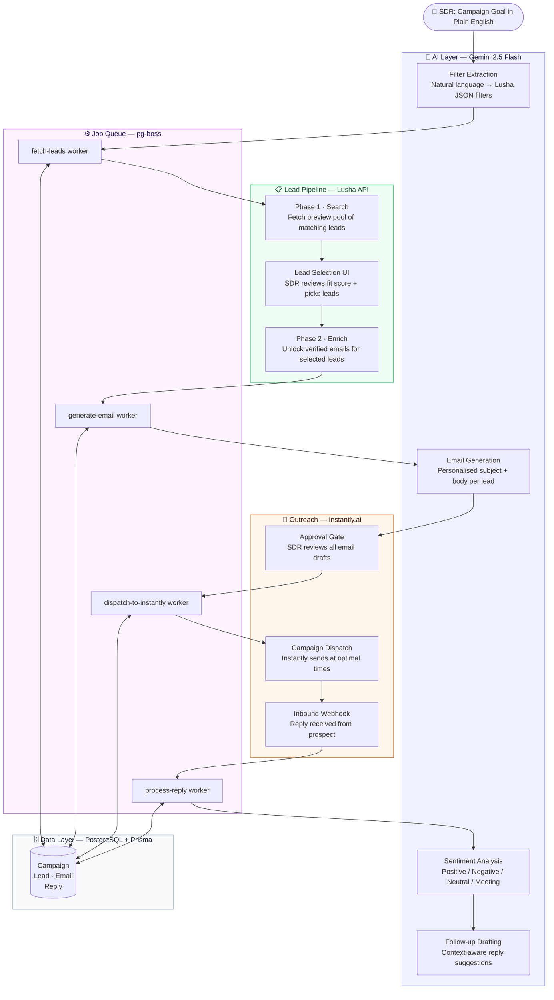

<div align="center">

<a href="https://github.com/vedant-valid/b2b_sales">
  
</a>

<br/>

[](https://nodejs.org)
[](https://nextjs.org)
[](https://postgresql.org)
[](https://deepmind.google/technologies/gemini)
[](https://prisma.io)

<br/>

> **Reduced 90% of manual SDR effort · Saved ₹1.25L in 3 months · Built for Newton School of Technology**

</div>

---

## The Problem

Newton School of Technology's SDR team was losing **3–5 hours every day** to tasks that should never require a human:

| Manual Task | Time Lost Daily |
|---|---|
| Searching for leads across platforms | ~1.5 hrs |
| Cleaning and deduplicating lead data | ~1 hr |
| Identifying high-potential prospects | ~1 hr |
| Writing and personalising outreach emails | ~1 hr |

Sales reps were spending more time on data entry than on actual selling — calls, demos, and closing deals.

---

## The Solution

A fully automated AI-powered SDR pipeline that handles everything from a plain-English campaign goal to personalised email dispatch and reply handling.

```
"Find CTOs at Series B SaaS startups in India"
         ↓
  Gemini extracts structured filters
         ↓
  Lusha surfaces 100s of matching leads
         ↓
  SDR reviews → selects best-fit leads
         ↓
  Lusha enriches with verified emails
         ↓
  Gemini writes personalised emails
         ↓
  SDR approves → Instantly dispatches
         ↓
  Inbound replies auto-classified + follow-ups drafted
```

---

## Results

<div align="center">

| Metric | Before | After |
|---|---|---|
| Daily manual SDR hours | 3–5 hrs | ~20 min |
| Lead sourcing time | 90 min | Automated |
| Email writing time | 60 min | Automated |
| Operational cost (3 months) | Baseline | **₹1.25L saved** |
| SDR focus | Data work | Calls & closing |

</div>

---

## System Architecture



---

## AI & Technology Stack

### AI / Intelligence
| Layer | Technology | Role |
|---|---|---|
| LLM Core | **Gemini 2.5 Flash** | Filter extraction, email generation, sentiment classification, follow-up drafting |
| Lead Intelligence | **Lusha API** | Two-phase: preview search → verified email enrichment |
| Email Automation | **Instantly.ai** | Deliverability-optimised dispatch + reply webhooks |

### Backend
| Technology | Version | Role |
|---|---|---|
| Node.js | v25 | Runtime |
| Express | 5 | REST API |
| Prisma | 6 | ORM + schema migrations |
| PostgreSQL | 16 | Primary database |
| pg-boss | 10 | Persistent job queue for async pipeline |
| Zod | 3 | Runtime schema validation |

### Frontend
| Technology | Version | Role |
|---|---|---|
| Next.js | 15 | React framework with App Router |
| React | 19 | UI library |
| Tailwind CSS | 4 | Styling |
| NextAuth.js | — | Session auth with JWT |

---

## Pipeline Deep Dive

### Two-Phase Lead Enrichment
Lusha charges per enrichment. The platform uses a **preview → select → enrich** flow so the SDR only unlocks emails for leads they've actually chosen — cutting Lusha credit waste.

### Approval Gates
Two human-in-the-loop checkpoints:
1. **Lead Selection** — SDR picks from the preview pool before any credits are spent
2. **Email Approval** — SDR reviews every draft before anything is sent

### Background Job Orchestration
All heavy work runs in `pg-boss` queues so the API stays non-blocking. Each worker picks up exactly where the last left off, with retries on failure:

```
fetch-leads → generate-email (×N leads) → dispatch-to-instantly → process-reply
```

### RBAC
Three roles — `ADMIN`, `MANAGER`, `VIEWER` — enforced at the route level via `requireRole()` middleware.

---

## Local Setup

```bash
# 1. Install dependencies
npm install

# 2. Set up environment (copy and fill in keys)
cp backend/.env.example backend/.env

# 3. Run migrations and seed
cd backend && npm run prisma:migrate && node prisma/seed.js

# 4. Start both servers
npm run dev:backend   # :4000
npm run dev:frontend  # :3000
```

**Required env vars:** `DATABASE_URL`, `JWT_SECRET`, `GEMINI_API_KEY`, `LUSHA_API_KEY`, `INSTANTLY_API_KEY`

---

<div align="center">

Built by [Vedant Madne](https://github.com/vedant-valid) for Newton School of Technology's SDR team.

</div>
